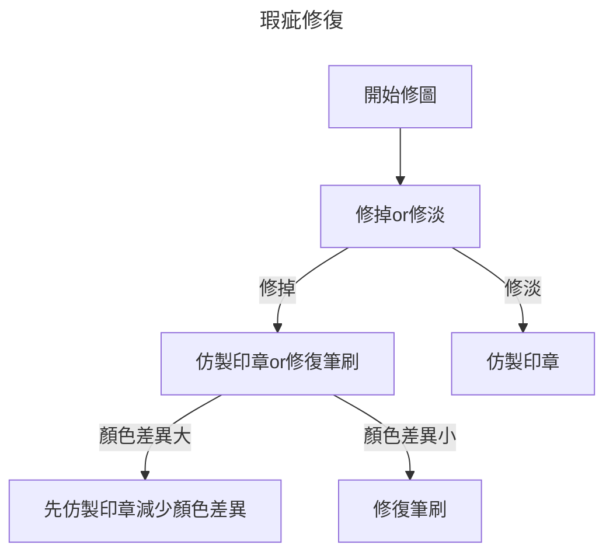

# Photoshop

---

## 先備知識

---

### 點陣圖與向量圖
- 點陣圖 (Pixel-based)： 由無數個小方格（像素）組成。放大後會模糊、出現鋸齒（馬賽克）。

> 適用： 照片、複雜的繪畫、光影變化豐富的圖像。

- 向量圖 (Vector)： 由數學公式運算出的線條和色塊。無限放大都不會模糊。

> 適用： Logo、文字排版、圖標。

先備觀念： 在 PS 裡放大圖片是有極限的，畫質一旦破壞通常救不回來。

---

### 基本色彩學

- RGB
- CMYK

---

#### RGB

- Red,Green,Blue
- 色光三原色
- 加色

---

#### CMYK

- Cyan,Magenta,Yellow,Black
- 色料三原色
- 減色

---

## 基本操作

---

### 縮放顯示

- 縮放顯示工具（Z）
> 搭配Alt切換放大縮小
- Alt + 滾輪
- Ctrl + +,Ctrl + -
- Ctrl + 0
- Ctrl + 1

---

### 移動畫面

- 手形工具（H）
- 空白鍵

---

## 人像編修

---

### 基本修復工具
- 汙點修復筆刷
- 修復筆刷
- 修補工具
- 紅眼工具
- 仿製印章

---

|      |         汙點修復筆刷         |    修復筆刷    |          仿製印章          |
| ---- |:----------------------------:|:--------------:|:--------------------------:|
| 取樣 |              X               |       O        |             O              |
| 抹勻 |              O               |       O        |             X              |
| 適用 | 適合顏色差異不大的小範圍修補 | 適合大部分修復 | 適合不需要與原圖融合的修復 |

---

### 修掉VS修淡

---

### 牙齒美白
- 選取牙齒，並複製到新圖層
- 影像／調整／色相飽和度，選擇黃色的部分，將飽和度調至最低。
- 使用曲線或色階將牙齒調亮
- 使用混和範圍將牙齒紋理顯現

### 刺青

---

### 皮膚柔化

#### 適用棚拍或妝容較完整的人像
- 複製圖層（Ctrl+J）
- 濾鏡／其他／顏色快調
- 濾鏡／模糊／高斯模糊：數值約為顏色快調的⅓
- 影像／調整／負片效果（Ctrl + I）
- 混合模式：線性光源
- 加上黑色圖層遮色片，把效果全部遮住，再用白色筆刷畫出柔化部分
- 可以再用圖層透明度調節整體柔化

---

#### 適用於大部分人像柔化
- 複製圖層（Ctrl+J）
- 混合模式：覆蓋
- 影像／調整／負片效果（Ctrl + I）
- 濾鏡／其他／顏色快調。柔化皮膚。
- 濾鏡／模糊／高斯模糊。加上紋理，若不需要還原此步可省略，
- 加上黑色圖層遮色片，把效果全部遮住，再用白色筆刷畫出柔化部分
- 可以再用圖層透明度調節整體柔化

---

#### 雀斑
- 複製圖層（Ctrl+J）
- 混合模式：強烈光源
- 影像／調整／負片效果（Ctrl + I）
- 濾鏡／其他／顏色快調。調整斑點與皮膚之間的柔化
- 加上黑色圖層遮色片，把效果全部遮住，再用白色筆刷畫出柔化部分
- 可以再用圖層透明度調節整體柔化
- 可以重複上述步驟

>雀斑通常顏色不會一樣，所以通常會執行兩次到三次。
重複步驟之前可以先合併（Ctrl + Alt + E）。

---
#### 色板柔化
- 複製圖層（Ctrl+J）
- 切換到色版面版，找到對比度最大的色版，通常是藍色色版
- 複製藍色色版，並套用顏色快調
- 影像／運算，來源1來源2不動，混合選擇線性光源或強烈光源。
- 若對比度不夠可重複執行上一步
- 影像／調整／負片效果
- 載入該色版選取範圍
- 點擊RGB色版，回到圖層面版，將剛剛的選取範圍複製到新圖層
- 調整色階或曲線 

---
## Youtube

[影像上光](https://www.youtube.com/watch?v=DlhRUUews2Y)
[移除雀斑(色板)](https://www.youtube.com/watch?v=J0BLH41cL0k)
[移除雀斑](https://www.youtube.com/watch?v=WfFnh0eP6HE)
[皮膚柔化](https://www.youtube.com/watch?v=JikLfXu--Jg)
[牙齒美白](https://www.youtube.com/watch?v=RvCDzD_mDHo)

---

## 常用快捷鍵

|  快捷鍵      | 內容     |
|-----------|--------|
| Ctrl + A  | 全選     |
| Ctrl + B  | 色彩平衡   |
| Ctrl + C  | 複製     |
| Ctrl + D  | 取消選取範圍 |
| Ctrl + E  | 合併圖層   |
| Ctrl + Alt + Shift + E  | 合併可見圖層後複製   |
| Ctrl + G  | 群組圖層   |
| Ctrl + I  | 負片效果   |
| Ctrl + J  | 拷貝至新圖層 |
| Ctrl + K  | 偏好設定   |
| Ctrl + L  |  色階   |
| Ctrl + M  | 曲線    |
| Ctrl + N  | 開新檔案  |
| Ctrl + O  | 開啟舊檔  |
| Ctrl + R  | 尺標    |
| Ctrl + S  | 儲存檔案  |
| Ctrl + T  | 任意變形  |
| Ctrl + U  | 色相飽和度 |
| Ctrl + V  | 貼上    |
| Ctrl + Z  | 回復上一步 |
