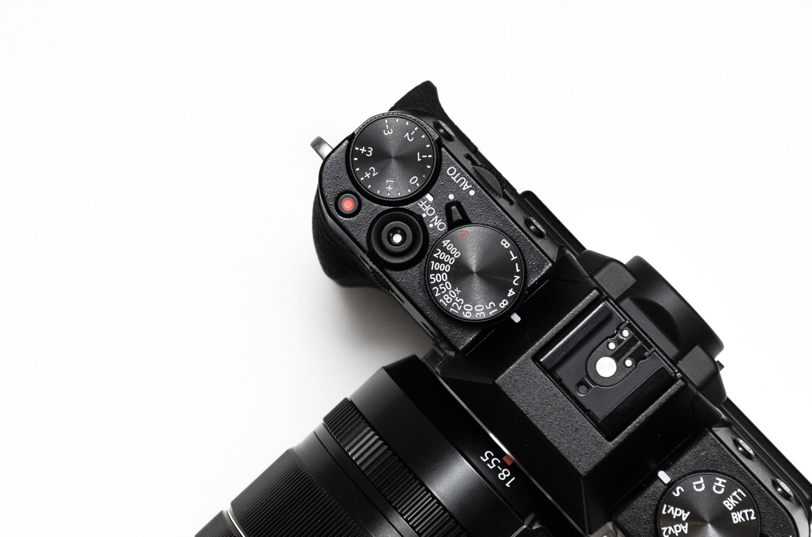
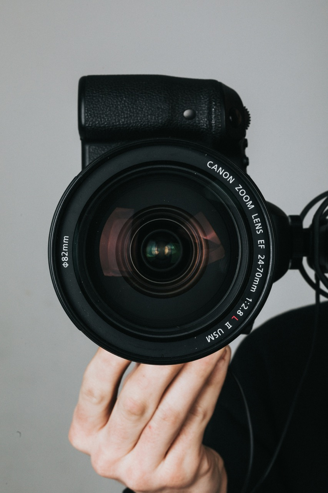
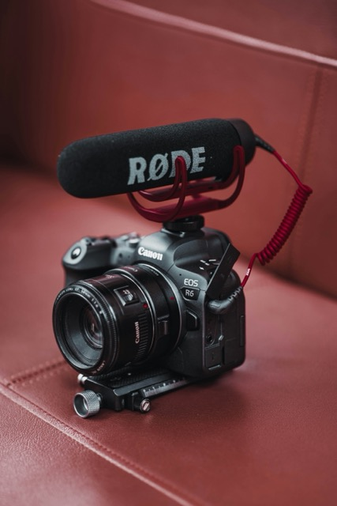

# 攝影器材介紹

---

<!--  -->
<!--  -->
## 相機種類

- 數位相機
- 單眼相機
- 運動相機
- 手機

---

## 數位相機

<!-- ## RX100 VII -->

- 輕便
- ~~價格親民~~
- ***不可換鏡頭***

---

---

## 單眼相機

- 單眼相機
  - APSC（片幅）
  - 全幅

- 無反光鏡單眼相機

---

## 單眼相機特色

- ***感光元件較大***
- 可換鏡頭
- 各項功能通常較好

---

## 鏡頭

- 定焦鏡
- 變焦鏡
  - 廣角：35mm以下
  - 標準：35-70mm
  - 望遠：70mm以上
- 微距鏡
- 旅遊鏡

---

## 鏡頭規格標示

- 卡口
- 焦段
- 光圈
- 種類
- 功能

---

### <!--fit-->Canon

---

---

### 常見代號

- EF/RF：適用的卡口
- L：俗稱的L鏡，C家中的高級鏡頭，前端有紅色圈圈
- IS：光學防手震
- STM：步進對焦馬達
- USM：超音波馬達
- Marco：微距鏡
- Fisheye：魚眼

---

## <!--fit--> Sony

---

---

---
<!--  -->
- E/FE：適用的卡口
- GM：俗稱GM鏡，S家的高規鏡頭，鏡頭上方會有橘色Logo
- ZA：蔡司鏡片
- G：規格次高的鏡頭
- OSS：光學防手震
- PZ：電動馬達
- SSM：超音波對焦馬達

---

## 運動相機

- 運動相機
- 360相機
- 拇指相機
- 其他

---

---

## 特性

- 防水防震
- 體積小
- 多配件支援
- 相對適合極端環境

---

---

---

---

---

---

## 空拍機

會飛

---

## 燈具

- 持續燈
- 閃光燈

---

## 濾鏡

- UV保護鏡
- 偏光鏡（CPL）
- 減光鏡（ND）
- 黑柔

---

<!-- ## 收音器材

- 指向式麥克風
- 無線麥克風

--- -->

## 其他配件

- 柔光罩、柔光傘、柔光箱
- 反光板
- 背景架
- 燈架、腳架
